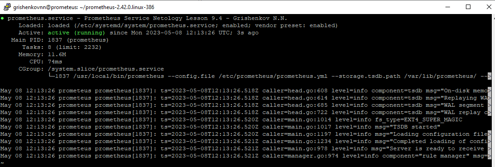
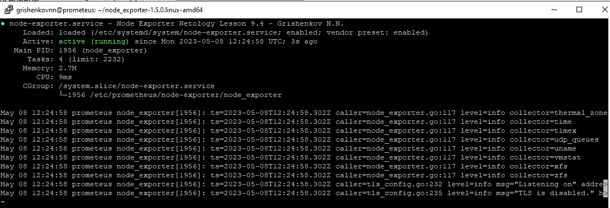
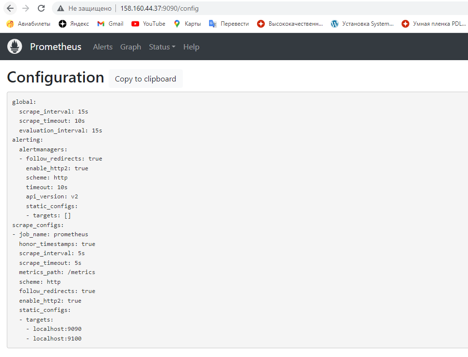
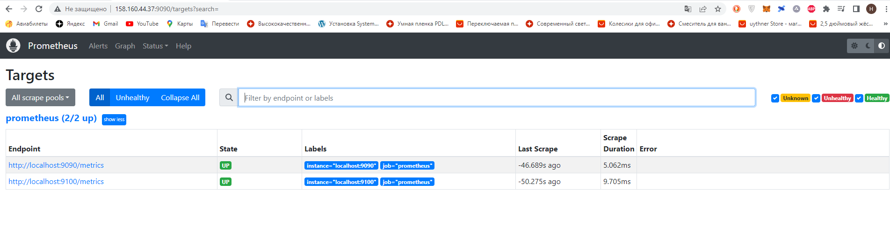

# Домашнее задание к занятию «Система мониторинга Prometheus»

В практике есть 3 основных и 2 дополнительных (со звездочкой) заданий. Основные задания нужно выполнять обязательно, со звездочкой - по желанию и его решение никак не повлияет на получение вами зачета по этому домашнему заданию, при этом вы сможете глубже и/или шире разобраться в материале. 

Пожалуйста, присылайте на проверку все задачи сразу. Любые вопросы по решению задавайте в чате учебной группы.

### Цели задания
1. Научитья создавать свои шаблоны в Zabbix, добавлять в Zabbix хосты и связывать шаблон с хостами
2. Научиться составлять кастомный дашборд
3. Научиться создавать UserParameter на Bash
4. Научиться создавать Python-скрип, добавляться в него UserParameter и прикреплять к шаблону
5. Научиться создавать Vagrant-скрипты для Zabbix Agent

### Чеклист готовности к домашнему заданию
- [ ] Просмотрите в личном кабинете занятие "Система мониторинга Prometheus" 

### Инструкция по выполнению домашнего задания

1. Сделайте fork [репозитория c шаблоном решения](https://github.com/netology-code/sys-pattern-homework) к себе в Github и переименуйте его по названию или номеру занятия, например, https://github.com/имя-вашего-репозитория/gitlab-hw или https://github.com/имя-вашего-репозитория/8-03-hw).
2. Выполните клонирование этого репозитория к себе на ПК с помощью команды `git clone`.
3. Выполните домашнее задание и заполните у себя локально этот файл README.md:
   - впишите вверху название занятия и ваши фамилию и имя;
   - в каждом задании добавьте решение в требуемом виде: текст/код/скриншоты/ссылка;
   - для корректного добавления скриншотов воспользуйтесь инструкцией [«Как вставить скриншот в шаблон с решением»](https://github.com/netology-code/sys-pattern-homework/blob/main/screen-instruction.md);
   - при оформлении используйте возможности языка разметки md. Коротко об этом можно посмотреть в [инструкции по MarkDown](https://github.com/netology-code/sys-pattern-homework/blob/main/md-instruction.md).
4. После завершения работы над домашним заданием сделайте коммит (`git commit -m "comment"`) и отправьте его на Github (`git push origin`).
5. Для проверки домашнего задания преподавателем в личном кабинете прикрепите и отправьте ссылку на решение в виде md-файла в вашем Github.
6. Любые вопросы задавайте в чате учебной группы и/или в разделе «Вопросы по заданию» в личном кабинете.

---

### Задание 1
Установите Prometheus.

#### Процесс выполнения
1. Выполняя задание, сверяйтесь с процессом, отражённым в записи лекции
2. Создайте пользователя prometheus
3. Скачайте prometheus и в соответствии с лекцией разместите файлы в целевые директории
4. Создайте сервис как показано на уроке
5. Проверьте что prometheus запускается, останавливается, перезапускается и отображает статус с помощью systemctl

#### Требования к результату
- [ ] Прикрепите к файлу README.md скриншот systemctl status prometheus, где будет написано: prometheus.service — Prometheus Service Netology Lesson 9.4 — [Ваши ФИО]

```
sudo useradd --no-create-home --shell /bin/false prometheus
wget https://github.com/prometheus/prometheus/releases/download/v2.42.0/prometheus-2.42.0.linux-386.tar.gz
tar xvfz prometheus-2.42.0.linux-386.tar.gz
cd prometheus-2.42.0.linux-386/
sudo mkdir /etc/prometheus
sudo mkdir /var/lib/prometheus
sudo cp ./prometheus promtool /usr/local/bin/
sudo cp -R ./console_libraries /etc/prometheus
sudo cp -R ./consoles /etc/prometheus
sudo cp ./prometheus.yml /etc/prometheus
sudo chown -R prometheus:prometheus /etc/prometheus /var/lib/prometheus
sudo chown prometheus:prometheus /usr/local/bin/prometheus
sudo chown prometheus:prometheus /usr/local/bin/promtool
/usr/local/bin/prometheus --config.file /etc/prometheus/prometheus.yml --storage.tsdb.path /var/lib/prometheus/ --web.console.templates=/etc/prometheus/consoles --web.console.libraries=/etc/prometheus/console_libraries
sudo nano /etc/systemd/system/prometheus.service #Содержимое файла ниже в блоке кода
sudo systemctl enable prometheus.service
sudo systemctl start prometheus.service
sudo systemctl status prometheus.service
```
Содержимое prometheus.service
```
[Unit]
Description=Prometheus Service Netology Lesson 9.4 - Grishenkov N.N.
After=network.target
[Service]
User=prometheus
Group=prometheus
Type=simple
ExecStart=/usr/local/bin/prometheus \
--config.file /etc/prometheus/prometheus.yml \
--storage.tsdb.path /var/lib/prometheus/ \
--web.console.templates=/etc/prometheus/consoles \
--web.console.libraries=/etc/prometheus/console_libraries
ExecReload=/bin/kill -HUP $MAINPID Restart=on-failure
[Install]
WantedBy=multi-user.target
```



---

### Задание 2
Установите Node Exporter.

#### Процесс выполнения
1. Выполняя ДЗ сверяйтесь с процессом отражённым в записи лекции.
3. Скачайте node exporter приведённый в презентации и в соответствии с лекцией разместите файлы в целевые директории
4. Создайте сервис для как показано на уроке
5. Проверьте что node exporter запускается, останавливается, перезапускается и отображает статус с помощью systemctl

#### Требования к результату
- [ ] Прикрепите к файлу README.md скриншот systemctl status node-exporter, где будет написано: node-exporter.service — Node Exporter Netology Lesson 9.4 — [Ваши ФИО]

```
wget https://github.com/prometheus/node_exporter/releases/download/v1.5.0/node_exporter-1.5.0.linux-amd64.tar.gz
tar xvfz node_exporter-1.5.0.linux-amd64.tar.gz
cd node_exporter-1.5.0.linux-amd64/
./node_exporter  #Проверяем доступность : http://158.160.44.37:9100/metrics
sudo mkdir /etc/prometheus/node-exporter
sudo cp ./* /etc/prometheus/node-exporter
chown -R prometheus:prometheus /etc/prometheus/node-exporter/
sudo nano /etc/systemd/system/node-exporter.service #Содержимое файла ниже в блоке кода
sudo systemctl enable node-exporter
sudo systemctl start node-exporter
sudo systemctl status node-exporter
```
Содержимое node-exporter.service
```
[Unit]
Description=Node Exporter Netology Lesson 9.4 - Grishenkov N.N.
After=network.target
[Service]
User=prometheus
Group=prometheus
Type=simple
ExecStart=/etc/prometheus/node-exporter/node_exporter
[Install]
WantedBy=multi-user.target 
```

---

### Задание 3
Подключите Node Exporter к серверу Prometheus.

#### Процесс выполнения
1. Выполняя ДЗ сверяйтесь с процессом отражённым в записи лекции.
2. Отредактируйте prometheus.yaml, добавив в массив таргетов установленный в задании 2 node exporter
3. Перезапустите prometheus
4. Проверьте что он запустился

#### Требования к результату
- [ ] Прикрепите к файлу README.md скриншот конфигурации из интерфейса Prometheus вкладки Status > Configuration
- [ ] Прикрепите к файлу README.md скриншот из интерфейса Prometheus вкладки Status > Targets, чтобы было видно минимум два эндпоинта

```
sudo nano /etc/prometheus/prometheus.yml #Содержимое файла ниже в блоке кода
sudo systemctl restart prometheus
```
Содержимое prometheus.yml
```
global:
  scrape_interval: 15s # Set the scrape interval to every 15 seconds. Default is every 1 minute.
  evaluation_interval: 15s # Evaluate rules every 15 seconds. The default is every 1 minute.
  # scrape_timeout is set to the global default (10s).

# Alertmanager configuration
alerting:
  alertmanagers:
    - static_configs:
        - targets:
          # - alertmanager:9093

# Load rules once and periodically evaluate them according to the global 'evaluation_interval'.
rule_files:
  # - "first_rules.yml"
  # - "second_rules.yml"

# A scrape configuration containing exactly one endpoint to scrape:
# Here it's Prometheus itself.
scrape_configs:
  # The job name is added as a label `job=<job_name>` to any timeseries scraped from this config.
  - job_name: "prometheus"
    scrape_interval: 5s
    # metrics_path defaults to '/metrics'
    # scheme defaults to 'http'.

    static_configs:
      - targets: ['localhost:9090', 'localhost:9100']
```



---
## Дополнительные задания со звёздочкой*
Эти задания дополнительные. Их можно не выполнять. Это не повлияет на зачёт. Вы можете их выполнить, если хотите глубже разобраться в материале.

---

### Задание 4*
Установите Grafana.

#### Требования к результату
- [ ] Прикрепите к файлу README.md скриншот левого нижнего угла интерфейса, чтобы при наведении на иконку пользователя были видны ваши ФИО


---

### Задание 5*
Интегрируйте Grafana и Prometheus.

#### Требования к результату
- [ ] Прикрепите к файлу README.md скриншот дашборда (ID:11074) с поступающими туда данными из Node Exporter

## Критерии оценки
1. Выполнено минимум 3 обязательных задания
2. Прикреплены требуемые скриншоты
3. Задание оформлено в шаблоне с решением и опубликовано на GitHub


